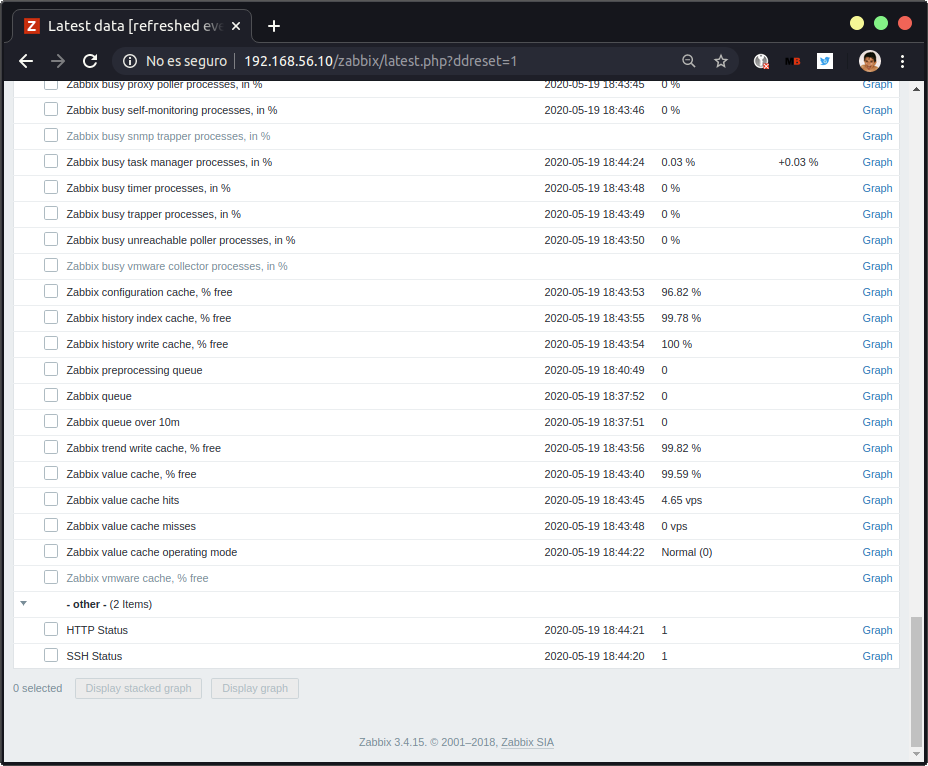
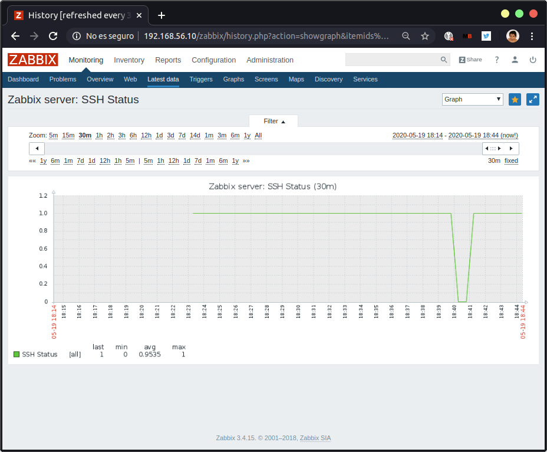
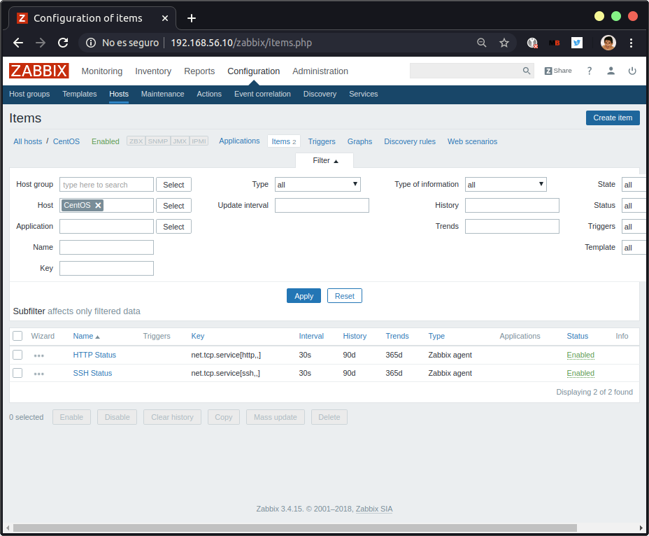
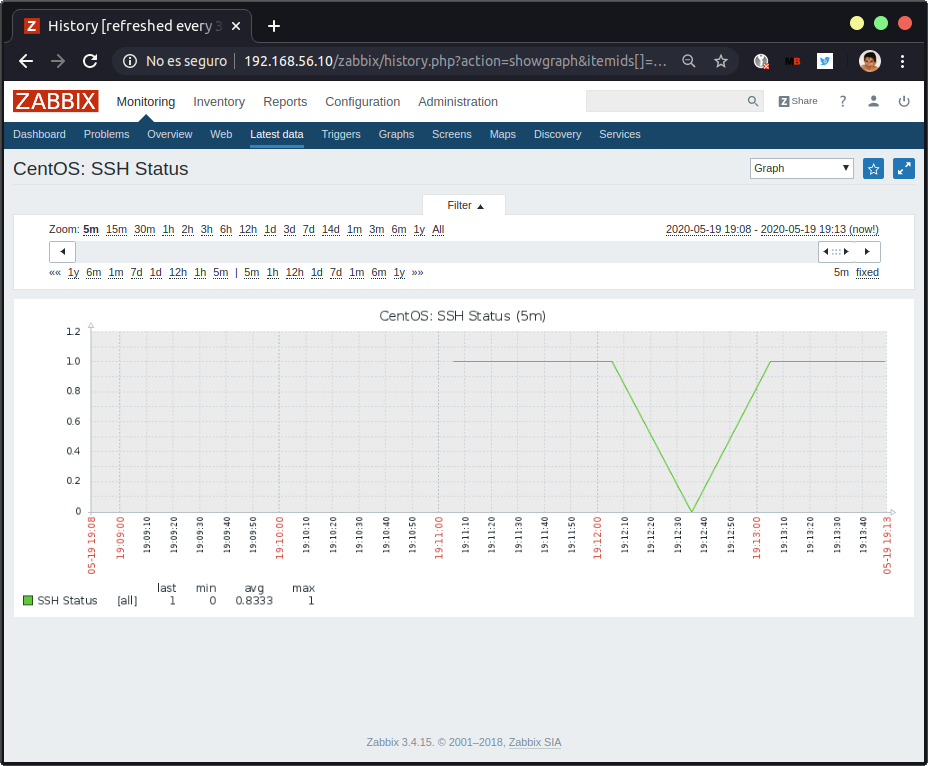

`ISE` > Prácticas > **Práctica 3.** Monitorización y _profiling_

# Lección 2. Herramientas de monitorización

## `top` y métricas fundamentales

Herramienta en consola sin interfaz gráfica.

* **load average:** carga media, se usa en evaluación del comportamiento de servidores (carga de CPU).

  * Es una media exponencial decayente del uso de la CPU durante los últimos 1 minuto, 5 minuto, 15 minutos (para cada uno de los tres valores, resp.).
    * Esto vale para ver si los picos son puntuales o más significativos.
  * Si tuviesemos una CPU con un solo núcleo (un solo proceso a la vez), la carga máxima de ese ordenador es 1. Esto quiere decir que si tuviesemos un 2 tendríamos un proceso que estaría esperando en cola para llegar a ser ejecutado. Si la CPU está parada podemos tener una carga muy baja. Si saturamos mucho la CPU subirá bastante.
  * Es la media de la longitud de los procesos que están esperando para ejecución y están en ejecución.
  * Se considera que una CPU saturada permanentemente por encima del 75% (0.75 en caso de 1 core) implica riesgo para el sistema: alto consumo de energía, alta temperatura -- puede dar lugar a fallos físicos.
    * Si tenemos dos cores, la carga máxima sería 2, con 4 cores 4, etc.

* Es un **agregador de información**: no la calcula de manera directa, sino que obtiene la información de diversas fuentes (como `proc`). Por ejemplo, los valores de `loadaverage` los tenemos en `/proc/loadavg`. Otro ejemplo: usando el comando `uptime` tenemos la primera línea de `top`.

* El profesor ha instalado `stress`, para disimular una determinada carga en el equipo. Hará bloqueos de acceso a disco. Copiando la línea de `stress`:

  ~~~
  stress --cpu 8 --io 4 --vn 2 --vn-bytes 128M --timeout 10s
  ~~~

* `vmstat` nos da las estadísticas de memoria virtual, que también las veremos en `top`.

* `free` nos da estadísticas de uso de memoria principal y swap.

* **tasks:** usa este término en lugar de _hebra_. Nos dice cuántas hay en los estados de SO:

  * running: en cola de ejecución, ejecutándose en CPU.
  * sleeping: está en espera de ejecución, cuando está realizando operaciones I/O normalmente.
  * stopped: es un proceso especial, en Linux podemos parar un proceso (con Ctrl+Z, ie), lo suele hacer un usuario.
  * zombie: es un proceso especial, se produce cuando los procesos hijos comunican el resultado a un proceso padre y deben morir dando un resultado (0 si OK, código de error >1). Si el hijo no devuelve el valor, sigue teniendo una entrada en la tabla de recursos aunque aparentemente está muerto. Si tenemos valores zombie sostenidos puede ser indicativo de un problema (los programas padres no hacen los _join_ bien).

* Pulsando en `?` nos sale la ayuda.

* Pulsando `H` nos conmuta entre threads y tasks (threads >= tasks).

* **%cpu(s):** porcentaje de uso de la CPU en espacio de usuario (**us**) y en espacio de sistema (**sy**). Sumando ambas tenemos la carga de la CPU, aunque es más eficiente la información de _load average_. Esto es porque los _probes_ del benchmark usado de esta información consumen recursos. En máquinas más cargadas puede que esta carga tenga mayor error.

  * El porcentaje de procesos que han sufrido un _nice_ (**ni**): los procesos tienen una prioridad y un sudoer puede cambiar la prioridad temporalmente. Es el tiempo de CPU gastado en estos procesos de baja prioridad.
  * Proceso *idle* (**id**): porcentaje del tiempo en el que no se hace nada. Dependiendo del SO el proceso _idle_ consume más o menos energía. Suelen hacerse _micropausas_ para optimizar el rendimiento (no es lo mismo cargar la CPU de un idle que uno normal).
  * **wa**: tiempo que la CPU ha pasado en espera (en disco).
  * % tiempo dedicado a interrupciones hardware (**hi**) y software (**si**).
  * Stolen time (**st**): % tiempo CPU medido en ciclos que un hipervisor está robando a la ejecución de tu propio ordenador (MVs). Cuánta capacidad de cálculo está robando. Sólo está disponible en hipervisores nativos de Linux, no en VirtualBox.

* **KiB Mem:** total disponible (principal), total libre, total usado, total buffer/caché (espacios de memoria que usa el SO para E/S; que estén asignados a buffer/caché no significa que estén asignados permanentemente -- si un proceso lo necesita lo usará). Pulsando `E` nos cambia la unidad de medida.

* **KiB Swap:** ídem con swap. La cifra final avail mem es una cifra que no se encuentra en todas las distribuciones de Linux. Nos da una idea aproximada de cuál sería el máximo de memoria que un proceso puede demandar actualmente y que puede ser concedida.

* **Procesos**, por defecto se ordenan por PID. Se pueden cambiar los criterios de ordenación. Con la `r` tenemos el orden inverso.

  * **PID**: ID del proceso.
  * **USER**: usuario que lo invocó.
  * **PR**ioridad: prioridad dinámica del proceso. Se calcula como NI+20. Si queremos que un proceso tenga prioridad 0, tenemos que darle -20 al valor de NI.
  * **NI**ce: prioridad estática asignada cuando un proceso es inicializado. Al principio vale siempre 0.
  * **VIRT**: cantidad de memoria usada.
  * **RES**: memoria principal RESidente que está consumiendo (cantidad de bloques o páginas que estamos realmente consumiendo).
  * **SHR**: espacio de memoria compartido. RES contiene también bloques que usan las librerías que importamos, pero esto no es necesariamente memoria consumida por nuestro programa. Por ejemplo, si dos programas usan la misma librería, ésta será sólo cargada una vez en memoria. SHR es justamente la cantidad de bloques que ocupan las librerías que importamos. Por tanto, la **memoria anónima** que es la que realmente consume el proceso se calcula como RES-SHR.
  * **S**: estado en el que se encuentra el proceso:
    * **D**: uninterruptible sleep
    * **R**: running
    * **S**: sleeping
    * **T**: traced or stopped
    * **Z**: zombie
  * **%CPU**
  * **%MEM**
  * **TIME** en ejecución
  * **COMMAND** del que viene (ver documentación para más info).

### Otros

* `htop`. Es más intuitivo.
* `gtop`. Depende de `node`.

> Enlace recomendado: https://benchmarksgame-team.pages.debian.net/benchmarksgame/

## Uso de una herramienta de monitorización

`top` no sirve para monitorizar una red de servidores, ni para tener un análisis histórico.

* **Munin**
* **Prometheus**. Funciona por _pull_ en lugar de _push_. Programado en Go: muy eficiente, poco pesado.
* **Prometheus** + **Grafana** (para gráficos) + **InfluxDB** (BD especializada en datos temporales, llega a ns): **PIG**
* **Zabbix**: arquitectura no trivial al contrario de Munin, podemos montar sistema de monitorización profesional no excesivamente complejo.

## Zabbix

* Usamos v3.4 por temas de compatibilidad.
* Permite monitorizar distintos elementos (routers, VPNs, ...), llamarlos y preguntarles información sobre su estado (telemetría: información, temperatura; procesos más complejo: número de instancias de Apache, cuánta memoria usa MySQL, cuántos usuarios). Se basa en plugins para conectarse con las distintas aplicaciones.
* Dos estrategias:
  * **push: empujar**
    * La toma de control se invierte: los equipos comunican a Zabbix para mandar la información que les es relevante cuando ellos consideran oportuno hacerlos.
  * **pull: muestrear**
    * Más antigua.
    * Si tenemos un servidor de Zabbix y tenemos que analizar el funcionamiento de cinco equipos, vamos uno por uno preguntando: muestreo secuencial de la información disponible.
  * ¿Qué estrategia es mejor? Se usa más _push_ porque deja la iniciativa al cliente, que decide si tiene algo relevante que comunicar o no. De este modo se reduce la carga del servidor principal, que sólo interviene cuando se necesita. No hay consenso sobre cuál es mejor, porque con push no tenemos control sobre cuándo recibimos la información, puede que se sature el servidor central.
* Zabbix admite ambos modos, aunque por defecto es pull.
* Diferentes tipos de procesos que intervienen en una configuración Zabbix:
  * Servidor: núcleo, recaba los datos de telemetría y los mete en una BD. Usaremos MySQL para BD. Zabbix usa BD relacional, aunque la mayor parte de los sistemas modernos usan BD más especializadas (documentadas o del tipo InfluxDB).
  * Agentes: procesos que corren en cada uno de los sistemas que queremos monitorizar. Tomará las medidas locales indicadas y las dará cuando Zabbix las pida. No pasa nada si Zabbix salta el agente en algún momento, el agente puede almacenar métricas y se las manda todas de golpe.
  * Proxy: estrategia para poder escalar. Cuando hay muchos equipos, un solo servidor no podrá muestrearlos todos. Se monta un proxy (un server en chiquitito) que muestrea un grupo local de equipos. De este modo, el server consulta a distintos proxys. Cada proxy mandará la información de varios equipos.
    * Cuando tenemos una comunicación TCP/IP, el tiempo de apertura es muy grande, por eso nos interesa que envíen mucha información.
  * Get: recomendado para ejercicio final de clase. Implementa una interfaz REST para consultar un agente de Zabbix. Es útil para depurar problemas de comunicación agente-servidor. Lanzamos una petición directamente y vemos si hay algún problema. Esto no se ve de forma tan sencilla en las gráficas del server. También permite desarrollar los propios clientes.
  * Frontend

Hay que hacer una red de monitorización en la que hay que monitorizar a la máquina Ubuntu además de a la CentOS.

### Instalación y configuración de Zabbix

Vamos a instalar Zabbix en Ubuntu para monitorizar CentOS.

#### Instalación del proxy y del servidor

1. Nos conectaremos a Ubuntu y a CentOS en dos terminales diferentes:

   > Nota: indicaremos con el prefijo `$U>` los comandos realizados en la shell de Ubuntu y con el prefijo `$C>` los comandos realizados en la shell de CentOS.

   ~~~
   $U> ssh mianfg@ubuise
   ~~~

   ~~~
   $C> ssh mianfg@centosise
   ~~~

2. En Ubuntu instalamos Zabbix de acuerdo al [manual de instalación](https://www.zabbix.com/documentation/3.4/manual/installation/install_from_packages/debian_ubuntu). Instalaremos Zabbix 3.4.

   > Importante: como estamos en Ubuntu 16.04, usamos el codename `xenial` en lugar de `bionic` (que es el correspondiente a Ubuntu 18.04).

   ~~~
   $U> wget https://repo.zabbix.com/zabbix/3.4/ubuntu/pool/main/z/zabbix-release/zabbix-release_3.4-1+xenial_all.deb
   $U> dpkg -i zabbix-release_3.4-1+xenial_all.deb
   $U> apt update
   ~~~

3. Instalamos el servidor, el proxy y el frontend. Usamos MySQL aprovechando que lo tenemos instalado (ver la práctica anterior). Si no lo tenemos instalado, haremos `apt install mariadb-server`.

   ~~~
   $U> apt install zabbix-server-mysql
   $U> apt install zabbix-proxy-mysql
   $U> apt install zabbix-frontend-php
   ~~~

   El último instalará PHP en caso de que no lo tengamos instalado.

4. Creamos las bases de datos necesarias en MySQL para el servidor y el proxy. Seguimos [este manual](https://www.zabbix.com/documentation/3.4/manual/appendix/install/db_scripts#mysql).

   ~~~
   $U> sudo mysql -uroot -p<password>
   mysql> create database zabbix_server character set utf8 collate utf8_bin;
   mysql> grant all privileges on zabbix_server.* to zabbix@localhost identified by '<password_usuario_zabbix>';
   mysql> create database zabbix_proxy character set utf8 collate utf8_bin;
   mysql> grant all privileges on zabbix_proxy.* to zabbix@localhost identified by '<password_usuario_zabbix>';
   mysql> quit;
   ~~~

   > Importante: cada `<password>` puede ser diferente. La primera es la contraseña para entrar como `root` a MariaDB. La segunda y la tercera es la contraseña del usuario `zabbix` en la BD. Podemos sustituir el usuario a otro nombre (cambiando `zabbix@localhost` a `tu@localhost`), pero lo dejarems así pues el usuario `zabbix` sólo podrá acceder a las tablas `zabbix_server` y `zabbix_proxy`.

5. Importamos los esquemas para la base de datos:

   ~~~
   $U> zcat /usr/share/doc/zabbix-server-mysql/create.sql.gz | mysql -uzabbix -p zabbix_server
   	# e insertamos la contraseña, <password_usuario_zabbix>
   $U> zcat /usr/share/doc/zabbix-proxy-mysql/schema.sql.gz | mysql -uzabbix -p zabbix_proxy
   	# e insertamos la contraseña, <password_usuario_zabbix>
   ~~~

6. Editamos los archivos de configuración del server y proxy de Zabbix:

   1. Archivo de configuración del server: `/etc/zabbix/zabbix_server.conf`.

      Debe tener los siguientes campos:

      ~~~
      DBHost=localhost
      DBName=zabbix_server
      DBUser=zabbix
      DBPassword=<password_usuario_zabbix>
      ~~~

   2. Archivo de configuración del proxy: `/etc/zabbix/zabbix_proxy.conf`.

      Debe tener los siguientes campos:

      ~~~
      DBHost=localhost
      DBName=zabbix_proxy
      DBUser=zabbix
      DBPassword=<password_usuario_zabbix>
      ~~~

7. Activamos los servicios y los configuramos para que se enciendan cuando lo haga el servidor.

   ~~~
   $U> service zabbix-server start
   $U> update-rc.d zabbix-server enable
   $U> service zabbix-proxy start
   $U> update-rc.d zabbix-proxy enable
   ~~~

8. Reiniciamos Apache.

   ~~~
   $U> service apache2 restart
   ~~~

9. Configuramos el timezone de Apache, descomentando la línea `date.timezone` del archivo `/etc/apache2/conf-enabled/zabbix.conf`.

10. Instalamos el agente.

    ~~~
    $U> apt install zabbix-agent
    ~~~

11. Iniciamos el agente.

    ~~~
    $U> service zabbix-agent start
    ~~~

#### Instalación del frontend

Lo instalaremos siguiendo [este manual](https://www.zabbix.com/documentation/3.4/manual/installation/install#installing_frontend).

1. Abrimos en el navegador `http://ubuise/zabbix` (donde `ubuise` es la IP de la máquina Ubuntu Server).

2. Iniciamos sesión con el usuario y contraseña por defecto: `Admin` y `zabbix` (atentos a las mayúsculas).

3. Activamos los puertos `10050` y `10051` sobre `tcp` en el firewall.

   ~~~
   $U> sudo ufw allow 10050/tcp
   $U> sudo ufw allow 10051/tcp
   ~~~

#### Usando Zabbix para monitorizar el propio servidor (Ubuntu)

1. Para crear un host, basta ver [este manual](https://www.zabbix.com/documentation/3.4/manual/quickstart/host). Nosotros comenzaremos con el creado por defecto en Configuration > Hosts.

2. Si nos da un error en el agente, que nos dice que no puede conectarse al host porque no estaba permitido, podremos ver este error en el frontend (el agente no es alcanzable) y en el log de `zabbix_agentd`. Lo solucionamos añadiendo la IP de Ubuntu a los hosts permitidos en el archivo de configuración `/etc/zabbix/zabbix_agentd.conf`.

   ~~~
   Server=127.0.0.1,192.168.56.10
   ~~~

3. Añadimos los ítem de SSH y HTTP, tal y como nos indican [aquí](https://www.zabbix.com/documentation/3.4/manual/quickstart/item).

   Un poco más de información sobre cómo agregarlos:

   1. Nos vamos al host en concreto, **Zabbix server** en nuestro caso (Zabbix server está en Ubuntu).

   2. Pulsamos en **Items**, y luego en **Create item**.

   3. Insertamos los siguientes campos:

      | Servicio | Name        | Key                     |
      | -------- | ----------- | ----------------------- |
      | SSH      | SSH Status  | net.tcp.service[ssh,,]  |
      | HTTP     | HTTP Status | net.tcp.service[http,,] |

      Realmente el campo _Name_ podemos nombrarlos como queramos. Las claves (_Key_) de los servicios podemos consultarlas en la [documentación de Zabbix](https://www.zabbix.com/documentation/3.4/manual/config/items/itemtypes/zabbix_agent).

   4. Pulsamos en **Add**.

4. Buscamos los gráficos para ver la información que está monitorizando Zabbix. Vamos a Monitoring > Latest data.

5. Colocamos los filtros: en Filter seleccionamos "Zabbix agent" en **Hosts**. Pulsamos en **Apply**.

6. En **- other -**, al final, y en caso de que no hayamos añadido un grupo al crear cada item, tenemos los items que acabamos de crear. Pulsamos en **Graph** para ver la información monitorizada.

   

7. Pararemos el servicio SSH, por ejemplo, para ver cómo Zabbix lo detecta:

   ~~~
   $U> systemctl stop ssh.service
   ~~~

   

#### Usando Zabbix para monitorizar otro servidor (CentOS)

1. Instalaremos el agente en CentOS. Para ello basta seguir [este tutorial](https://www.zabbix.com/documentation/3.4/manual/installation/install_from_packages/rhel_centos).

   ~~~
   $C> sudo rpm -ivh https://repo.zabbix.com/zabbix/3.4/rhel/7/x86_64/zabbix-release-3.4-2.el7.noarch.rpm
   $C> sudo yum install zabbix-agent
   $C> service zabbix-agent start
   ~~~

2. Nos da un error: _Job for zabbix-agent.service failed because a configured resource limit was exceeded._ Podemos arreglarlo deshabilitando SELINUX, tal y como se nos indica [aquí](https://support.zabbix.com/browse/ZBX-14922) y [aquí](https://linuxize.com/post/how-to-disable-selinux-on-centos-7/). Basta modificar la línea siguiente de `/etc/selinux/config`:

   ~~~
   SELINUX=disabled
   ~~~

   Y reiniciando CentOS (`sudo shutdown -r now`). Una vez reiniciado, podemos comprobarlo con la orden `sestatus`. Volvemos a iniciar el servicio y nos dejará sin problemas:

   ~~~
   $C> service zabbix-agent start
   ~~~

3. Abrimos los puertos necesarios:

   ~~~
   $C> sudo firewall-cmd --add-port=10050/tcp --permanent
   $C> sudo firewall-cmd --add-port=10051/tcp --permanent
   $C> systemctl restart firewalld
   $C> systemctl restart zabbix-agent
   ~~~

4. Modificamos `/etc/zabbix/zabbix_agentd.conf` y añadimos la IP del servidor donde está Zabbix Server (Ubuntu en nuestro caso) en `Server` y en `ServerActive`.

5. En el frontend de Zabbix creamos un nuevo host en Configuration > Hosts, y luego en **Create host**. Lo nombraremos **CentOS**, y cambiaremos **IP Address**, en **Agent interfaces**, a la IP de CentOS. Lo añadimos a un grupo (pues si no no nos dejará añadirlo). Pulsamos en **Add**.

6. Añadimos los items SSH y HTTP, de forma análoga a en el caso de Ubuntu.

   

7. Desactivamos alguno de ambos, por ejemplo SSH, para ver cómo Zabbix lo monitoriza correctamente. En la captura siguiente aparece el resultado de parar el servicio `sshd`, y luego volver a iniciarlo.

   

## Ansible

* Es un producto de RedHat enmarcado en los productos de **gestión de la configuración** (labor que hacen los administradores de sistemas para llevar un equipo a una configuración conocida: ciertas cuentas con ciertos privilegios, cierta configuración de firewall, de aplicaciones instaladas, etc.)

  * Opciones:
    * Hacerlo manualmente.
    * Instalar un SO con ciertas preconfiguraciones, de modo que haya cuantos menos preguntas en la instalación mejor.
    * VMs elaboradas para determinadas configuraciones. Ej. Vagrant permite definir las imágenes de forma que no dependa de la tecnología de virtualización.
    * Definir la configuración con ficheros en texto plano. No propietario de fabricante, sin vincularse a tecnología concreta. Como todos los proyectos se almacenan en repositorios, se trata del formato ideal.

* Ansible se conecta con un equipo y lo configura. Puede lanzarse en paralelo (muchas hebras, muchos equipos simulténeamente). Lo veremos en el ámbito de la automatización, pero donde más se utiliza es en el uso de Playbooks (término propio de Ansible): ficheros de texto que permiten definir la configuración de un equipo.

* Veremos Ansible en el contexto de ejecución de comandos (aunque nos anima a ver los Playbooks).

* Ejecuta Ansible desde el ordenador anfitrión, ha creado una máquina más para hacer gesitones en tres máquinas.

* **Inventario:** lista de ordenadores con los que vamos a trabajar. En los equipos Linux está disponible como paquete.

  ```
  apt install ansible
  ```

  Por defecto se encuentra en `/etc/ansible/hosts`.

* El archivo de configuración interna está en `/etc/ansible/ansible.cfg`. En la instalación por defecto todas las líneas están comentadas, el comportamiento por defecto es razonable.

  * Si no tenemos acceso de root a ese archivo, en el directorio `home` tenemos el fichero `.ansible.cfg`.

* En el host añadimos la IP del equipo, o un nombre simbólico.

  ```
  ubudef ansible_host=192.168.56.11
  ```

  Si el ordenador estuviese accesible por un DNS o en un archivo _host_ no hace falta añadir el parámetro `ansible_host`.

---

* Comprobar que Ansible está correctamente configurado, tanto en host como en otros.

  ```
  ansible ubudef -m ping
  ```

  `m` viene de _módulo_. Hemos puesto el nombre del catálogo. Nos dice que es _unreachable_. Esto puede ser por temas de _firewall_. Luego veremos cómo resolverlo.

  * En la dirección de la referencia tenemos una lista de los módulos de Ansible.

  * El error se debe a que nos estamos intentando conectar como el usuario del _host_. Si el usuario no existe, no se conectará. Para ello debemos hacer que se conecte usando otro usuario:

    ```
    ansible ubudef -m ping -u david
    ```

    Tampoco se conecta porque requiere insertar una contraseña, dando un error de _permission denied_. Crearemos un usuario en la máquina, que deberá permitir el acceso sin contraseña.

    ```
    useradd -m mjose
    ```

    Con este usuario si no tiene contraseña podremos conectarnos. Para configurarse en un ordenador Ansible necesita acceso sin contraseña y Python (eso lo vemos en el feedback del _ping_). Podemos pasar el parámetro `data` con `-a` (_arguments_).

    ```
    ansible ubudef -m ping -u mjose -a 'data="hola hola caracola"'
    ```

  Para evitar tener que recordar qué cuentas tenemos configuradas en cada ordenador, lo mejor es llevarlo al fichero de inventario:

  ```
  ubudef ansible_host=... ansible_user=mjose
  ```

  Añadimos más usuarios a `hosts`: `cenise` y `ubuise`. Haciendo `ping` a ellos vemos que se conecta bien.

  Si no tenemos la configuración de acceso sin contraseña en CentOS, hacemos

  ```
  ssh-copy-id david@cenise
  ```

* Usar todas las máquinas

  ```
  ansible all -m ping
  ```

  Ansible no lo hace en secuencia, sino en paralelo. El número máximo de hebras puede cambiarse (el profesor dice que cree que por defecto es 5).

* Asignar nombres simbólicos: añadimos en el archivo `hosts`:

  ```
  [lamp]
  cenise
  ubuise
  ```

  De este modo podemos hacer `ping` a los equipos `lamp`:

  ```
  ansible lamb -m ping
  ```

* Módulo `shell`

  ```
  ansible all -m shell -a 'echo $PATH'
  ```

  Coge la configuración del acceso remoto definida en `/etc/profile`. Si necesitamos algo con un `PATH` más complicado, podemos indicar el PATH completo o configurar el equipo antes.

  Lo normal es configurar el equipo en dos fases:

  1. Configurar usuarios, paths.
  2. Realizamos el resto de configuraciones.

  El `-m shell` puede omitirse porque es el módulo por defecto.

* Módulo de configuración de servicios, equivalente a `systemctl`.

  Es importante que los verbos son _stopped_, no _stop_: Ansible lleva una programación declarativa (describe el estado al que queremos llevar el sistema). Es decir, si ya está parado no hace nada y si no, lo para. El interés es **llevar el equipo a un estado**: por eso indicamos en qué estado lo queremos, no los pasos que queremos seguir para alcanzarlo (programación procedimental).

  * Apagar Apache

    ```
    ansible cenise -m service -a "name=httpd state=stopped"
    ```

    Como nos estamos conectando con un usuario no privilegiado, puede que no nos deje apagar el servicio. Los módulos de Ansible hacen llamadas a programas que existen (por ejemplo, vemos que en el error tenemos `systemctl`). Podemos hacer nuestros propios módulos basados en llamadas en remoto, pero es importante que las acciones deben ser **idempotentes**: el efecto en el sistema debe ser el mismo independientemente del número de repeticiones en una llamada.

    Si pusiésemos `started` nos daría una confirmación, porque no requiere privilegios.

    **Cómo hacer acciones que requieren un usuario privilegiado:**

    ```
    ansible ubudef -m ping --become
    ```

    Nos dice que nos falta la contraseña: _missing sudo password_. Necesitamos configurar usuarios que puedan convertirse en root sin contraseña. Para ello debemos modificar el fichero `/etc/sudoers`. Modificamos `admin`:

    ```
    %admin ALL=(ALL) NOPASSWD:ALL
    ```

    ```
    groupadd admin
    ```

    ```
    usermod -G admin david
    ```

    Añadimos el grupo `admin` como grupo secundario. En CentOS el grupo ya viene preparado: es `wheel` (ver `sudoers` en CentOS). Volvemos a repetir con `--become` y vemos que funciona.

    Ahora añadimos el `--become` y listo.

* Definir variables por equipo (el nombre de la variable puede ser el que queramos)

  ```
  [lamp]
  cenise http_service='httpd'
  ubuise http_service='apache2'
  ```

  Esto es porque los servicios son distintos en Ubuntu y en CentOS. En la cadena hacemos una clave de reemplazo:

  ```
  ansible lamp -m service -a "name={{http_service}} state=stopped" --become
  ```


###### Tarea

No hay que entregar nada pero quiere que lo practiquemos. Ser capaces de apagar todas las máquinas que estemos configurando (`poweroff` o `reboot`).