`ISE` > Prácticas > **Práctica 4.** Benchmarking y ajuste del sistema

## Benchmarking con Phoronix

* Benchmark en distintos lenguajes, deben compilarse para poder ejecutarse.
  * Hay que ver qué lenguajes para ver las dependencias necesarias.
* Tiene tests individuales y suites (conjunto de benchmarks que se reúnen en una colección bajo un título, se suelen reunir los benchmarks que tienen sentido para una aplicación concreta; ej.: servidor web)
  * Ejecutaremos tests individuales porque las suites son muy grandes

Lo usaremos en Ubuntu.

* La suite se instala como un paquete más de Ubuntu, lo buscamos:

  ~~~
  apt-cache search phoronix
  apt-get install phoronix-test-suite
  ~~~

* Vemos todas las opciones haciendo directamente `phoronix-test-suite`

* Información del equipo: `phoronix-test-suite system-info`

* Información de sensores: `phoronix-test-suite system-sensors`

  * En la máquina virtual muchos sensores (frecuencia de ventilador, temperatura...) no los tenemos

* Listado de las suites disponibles: no baja nada, no ocupa espacio en disco (como un `apt-cache search`):

  ~~~
  phoronix-test-suite list-available-suites
  ~~~

  * Si nos salta el error de que la información viene comprimida, es porque necesita `unzip` instalado.

* Vemos los tests individuales

  ~~~
  phoronix-test-suite list-available-tests
  ~~~

  * Los gráficos no funcionarán con la MV, necesitan entorno de ventanas.
  * Mejor probar con los de procesador y memoria

* Vemos información de un test

  ~~~
  phoronix-test-suite info pts/stream
  ~~~

  * Esto tampoco ocupa espacio en memoria, es una consulta a Phoronix
  * Vemos que tienen dependencias software: _compiler / development libraries_

* Ejecutaremos un test con pocas dependencias, como `pts/compress-gzip`

  * Para ejecutarlo tenemos dos opciones:

    ~~~
    phoronix-test-suite benchmark pts/compress-gzip
    	// se baja el test y lo ejecuta
    phoronix-test-suite install pts/compress-gzip	// bajar test
    phoronix-test-suite run pts/compress-gzip		// ejecutar test
    ~~~

* Vemos que nos da los _test results_.

* Vemos los resultados que hemos almacenado:

  ~~~
  phoronix-test-suite list-saved-results
  phoronix-test-suite result-file-to-text ise2020
  ~~~

###### Tarea

Buscar un test con una documentación significativa para ejecutarlo y analizar los resultados. No hace falta entregar nada.

## Apache Benchmark: `ab`

* Exclusivo de HTTP, simula carga de servidores HTTP para cualquier servidor de HTTP, no únicamente Apache Server.

* Se ejecuta como una sola instrucción por línea de comandos.

* Instalamos `ab`.

* ~~~
  ab -n 10 -c 5 http://www.ugr.es/
  ~~~

  * `-n` número total de peticiones GET
  * `-c` simular concurrencia (varios usuarios en paralelo)
    * `ab` siempre corre **un solo hilo**, en este caso ese hilo tendría 5 procesos a la vez. Que -c sea 5 no quiere decir que se lancen dos hilos con 5 procesos cada uno. Más bien funcionaría así:
      	1. Numeraremos los procesos del 1 al 10, ab lanzará los cinco primeros: `[1,2,3,4,5]`
       	2. Acaba primero el proceso 3, entra el 6 a reemplazarlo y entonces estarán a la vez: `[1,2,6,4,5]`
       	3. Acaba el proceso 5, entra el 7: `[1,2,6,4,7]`
       	4. Y así sucesivamente
  * Document length tiene 162 bytes: sospechamos que no es el documento de la web
    * Hacemos `curl "http://www.ugr.es/"`
    * Vemos una página de redirección (haciendo curl tenemos un código 301), nos dice que tenemos que hacer una llamada a HTTPS
    * Ahora hacemos `ab` a `https://www.ugr.es/`.
  * Hay que entender todos los resultados de `ab`:
    * Puerto
    * Encriptación usada para HTTPS
    * Tamaño de información devuelto
    * Tiempo que le ha llevado ejecutar todo el test
    * Número de peticiones que han fallado
    * Total de información transferida
    * Cantidad de información HTML
    * mean = media, median = mediana
  * Connection Times:
      * Tiempo de conexión: tiempo que le lleva al proceso al abrir el socket (cuando abrimos una conexión TCP se ejecuta un proceso).
      * Tiempo de procesamiento (_processing_): tiempo que ha tardado en llegar el primer byte + tiempo de transferencia
      * Tiempo de espera (_waiting_): tiempo que ha tardado en llegar el primer byte (desde que se realiza la conexión hasta la recepción de éste)
      * Tiempo total (_total_): tiempo que tarda en total, suma de _connect_ + _processing_.
  
* `ab` es una carga a lo bruto, no simula una carga real: Nginx es lo suficientemente inteligente para no abrir muchos procesos hijo para cada petición (pues todos vienen de la misma IP).

* Para qué sirve entonces:

  * Para ver si puede aguantar muchas peticiones, para una cosa rapidilla

* No llega para algo más complicado: **JMeter**

## JMeter

Para hacer una carga realista tenemos que distribuir la carga, similar a lo que se hace en un ataque DDoS.

* Podemos hacer cargas sintéticas: simulación de comportamiento de usuarios.
* Podemos hacer cargas reales: podemos coger un fichero de log de Apache y simular la carga (de este modo podemos usar el comportamiento de un sistema ante una carga habitual).
  * También podemos hacer carga a bases de datos y a otras muchas cosas.
  * Podemos también simular, por ejemplo, "4 veces la carga del Black Friday": simulamos la carga con 4 hebras en paralelo ejecutando el log.

Vamos a lanzar la aplicación de esta práctica, `iseP4Jmeter`.

* MongoDB
  * Es _schema free_: nos deja modificar los modelos en caliente.
  * Es NoSQL y tiene optimización en lectura. Tiene varios nodos read-only y unos pocos read-write. MongoDB se encarga de mantener la coherencia.
    * Normalmente la frecuencia de lectura es mayor que la frecuencia de escritura. En este tipo de escenarios, es útil tener este tipo de BD, optimizadas para lectura.
* El frontend del servicio es el puerto 3000.
* Tenemos un puerto para acceder a Mongo, en producción no se pondría.
* Docker es el que resuelve las IP con dockercompose. Si nos fijamos en `package.json`, no explicitamos la IP en Mongo, ponemos `mongodb`.

Levantamos el servicio

~~~
docker-compose up
~~~

* Hace que los locks del sistema se queden vinculados a la consola. Si queremos lanzarlo en _background_, usamos

  ~~~
  docker-compose -d up
  ~~~

  * Para consultar los logs hay que usar `docker`.
  * Se reúnen los logs de todas las máquinas en un único stream de logs. Muy util para clusters.

* El script `pruebaentorno.sh`

  * Prueba que el endpoint sea `localhost`: sólo podemos ejecutarlo desde la propia máquina.
  * Llama a `curl`.
    * Se puede guardar el resultado con `$()`. Retorna un JWT (JSON Web Token), muy usado en interfaces tipo REST.
      * Uso de verbos protocolo HTTP para hacer operaciones CRUD.
      * Existencia de entidades en el que haremos transferencias.
      * No guardamos sesión en el servidor. ¿Cómo mantenemos la identidad del usuario?
        * Tradicionalmente mediante cookies, pero la API REST no nos deja.
        * Pasamos en su lugar tokens completos.
    * Hay que aprender a hacer GET y POST.

* Acceso proporcionado por `BasicAuth`. Las credenciales se mandan en abierto, sin cifrar.

  * Se suele usar para proteger endpoints, servicios sacados a Internet público.
  * Ruido de Internet: en cuanto abrimos un puerto a Internet público empezamos a recibir ataques.
  * Si dejamos el servicio abierto vamos a recibir peticiones con login y password, este BasicAuth hace que solo las personas que conozcan unas ciertas credenciales puedan acceder.
  * Se suele usar para APIs privadas.

* Validar JWT online: jwt.io

  * Register claims principales
    * `sub`: PK del individuo
    * `iat`: momento en el que se generó el token
    * `nof`: token no es válido antes de un momento dado (para tener que esperar un poco hasta cargar)
    * `exp`: cuándo expira el token
  * Este es personalizado, no es un register claim estándar
    * `role`: rol (esta info es la que consume el método GET para decir si tenes derechos o no para consultar un cierto expediente)
  * Esta validación se hace de forma casi automática: ha instalado un módulo de Node.
  * La información no está cifrada. Por tanto, no pasar información confidencial por aquí.
  * La información está firmada. Para hacer la firma se usa una llave simétrica configurada en el _endpoint_. La clave está en `nodejs/config/config.json`, en `jwtTokenSecret`.
  * Muchas veces el ordenador que genera el token no es el mismo que lo consume. Hay protocolos más avanzados, como OAuth, basado también en JWT.
  * JWT:
    * No está cifrado
    * Está firmado

Comenzamos a trabajar sobre JMeter.

##### Pruebas de carga con JMeter

* Hay que hacerlas en un ordenador distinto (donde corre JMeter debe ser distinto a donde corra Kubernetes). Para probar, ejecutamos `pruebaEntorno.sh` desde el ordenador donde esté JMeter.

* JMeter corre sobre Java, instalar una versión superior a 8. El profesor usará Java 11.

* Entramos en la interfaz de JMeter. 

  ~~~
  jMeter jmeter &
  ~~~

* Ver punto a continuación para configurar el test.

### Desarrollo práctico: prueba de carga con JMeter

###### 1. Instalamos `docker` y `docker-compose` en Ubuntu Server

Para instalar `docker`:

1. Añadimos llave GPG para validar el repositorio:

   ~~~
   curl -fsSL https://download.docker.com/linux/ubuntu/gpg | sudo apt-key add -
   ~~~

2. Añadimos repositorio:

   ~~~
   sudo add-apt-repository "deb [arch=amd64] https://download.docker.com/linux/ubuntu $(lsb_release -cs) stable"
   ~~~

3. Actualizamos la lista de repositorios:

   ~~~
   sudo apt update
   ~~~

4. Buscamos el repositorio de Docker CE (Community Edition) y lo instalamos:

   ~~~
   apt search docker-ce
   sudo apt install docker-ce
   ~~~

5. Comprobamos el estado del servicio con `systemctl`.

6. Añadimos tu usuario al grupo `docker`:

   ~~~
   sudo usermod -aG docker <tu_username>
   ~~~

7. Probamos los comandos:

   ~~~
   docker info
   docker run hello-world
   ~~~

   > Nota: es posible que nos de el error _Got permission denied while trying to connect to the Docker daemon socket at unix_. Esto puede deberse a que la consola no interpreta todavía que tu usuario esté en el grupo `docker`. Basta hacer `su` o volver a iniciar sesión para que actualice los permisos.

Para instalar `docker-compose`:

1. Fasiil

   ~~~
   sudo apt install docker-compose
   ~~~

2. Comprobamos

   ~~~
   docker-compose
   docker-compose --version
   ~~~

###### 2. Instalación de la aplicación para testear

Basta clonar el repo:

~~~
git clone https://github.com/davidPalomar-ugr/iseP4JMeter.git
~~~

Lo levantamos con `docker-compose`:

~~~
cd iseP4JMeter
docker-compose up
~~~

Si queremos lanzarlo en background hacemos:

~~~
docker-compose -d up
~~~

###### 3. Instalación de JMeter

Como JMeter lo vamos a usar con la GUI inicialmente, instalaremos JMeter en el host. Para ello, basta ir a la sección Downloads en <https://jmeter.apache.org>.

* Descomprimimos el archivo descargado.
* Para ejecutar la GUI:
  * Desde la terminal, ejecutamos `bin/jmeter`.
* A continuación, cada vez que pongamos en la terminal `jmeter` significará que estamos ejecutando el archivo `jmeter` de la carpeta `bin` de JMeter.

###### 4. Configurar el test

En el archivo [`test.jmx`](./test.jmx) puedes encontrar la configuración final guardada.

1. Configuramos el host y el puerto

   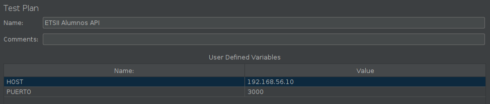

2. Hacemos dos grupos de hebras, para simular por una parte los alumnos y por otra los administradores. Modificamos las propiedades para hacer varias pruebas por cada hilo.

   * Los grupos de hebras simulan la carga de trabajo. Hemos de simular dos perfiles de usuarios distintos (alumnos y administrativos).

     * Podemos usar JMeters para tests funcionales, pero suele usarse para test de carga (_assertions_).
     * Thread Properties:
       * Number of Threads (users): número de hebras concurrentes, simula el número de usuarios que van a estar usando el sistema.
       * Ramp-up Period: segundos en los que se distribuirán. Permite que el sistema aloque recursos de forma progresiva, que es un comportamiento más usual.
       * Loop Count
       * Scheduler: planificación

   > Botón derecho sobre ETSII Alumnos API: Add > Threads (Users) > Thread Group

   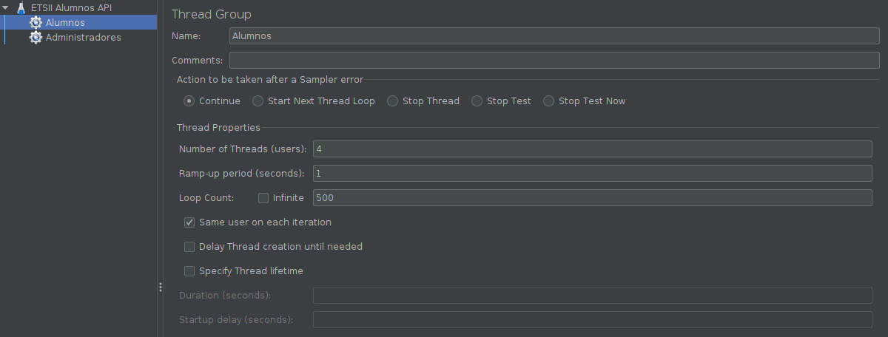

3. Añadimos la petición HTTP. Insertamos el nombre del servidor, puerto y ruta para la petición HTTP.

   > Add > Config element > HTTP Request Defaults
   >
   > Nota: reorganizamos, colocamos Access to ETSII API primero (aunque no influye realmente el orden en una misma anidación, lo colocaremos como aparece en la memoria de prácticas)
   >
   > En HTTP Request > Path podemos añadir "/api/v1", aunque no es necesario

   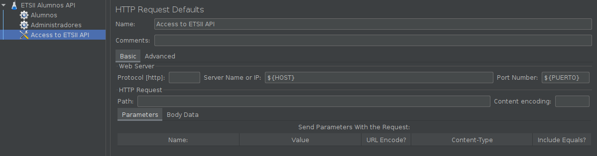

4. Añadimos la autorización BasicAuth.

   > Add > Config Element > HTTP Authorization Manager
   >
   > La contraseña es `laApiDeLaETSIIDaLache`.
   >
   > :warning: **Errata:** en Base URL poner `${PUERTO}` en lugar de `${PORT}`, pues hemos definido la variable `PUERTO`, no `PORT`.

   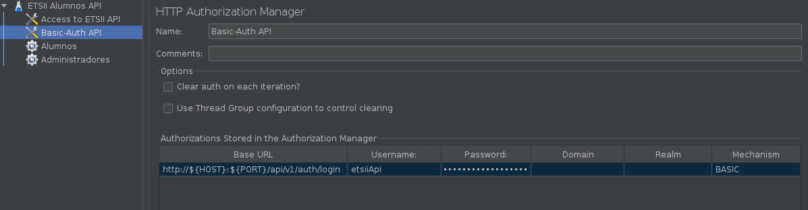

5. Configuramos el acceso por credenciales.

   > Alumnos (click derecho) > Alumnos > Add > Config element > CSV Data Set Config
   >
   > En Filename ponemos la ruta completa al archivo CSV con los logins.

   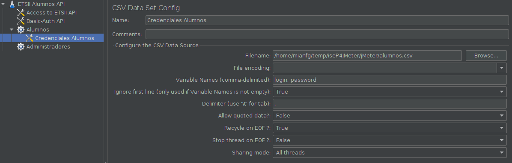

6. Añadimos el login de los alumnos.

   > Alumnos (click derecho) > Add > Sampler > HTTP Request

   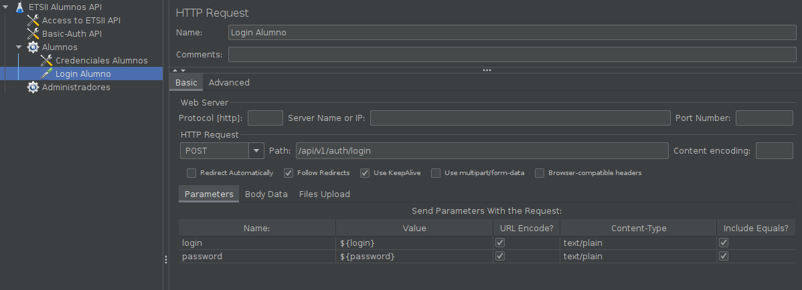

7. Extraemos el token del login del alumno, con un extractor de expresiones regulares

   > Login Alumno (click derecho) > Add > Post Processors > Regular Expressions Extractor

   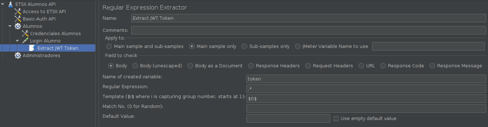

8. Añadimos el temporizador aleatorio gaussiano

   > Alumnos (click derecho) > Add > Timer > Gaussian Random Timer

   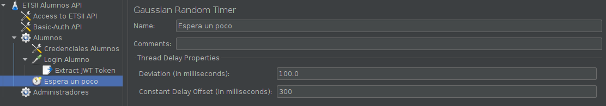

9. Añadimos la recuperación de los datos de los alumnos

   > Alumnos (click derecho) > Add > Sampler > HTTP Request
   >
   > :warning: **Errata:** en HTTP Request > Path hay que poner: `/api/v1/alumnos/alumno/${__urlencode(${login})}`

   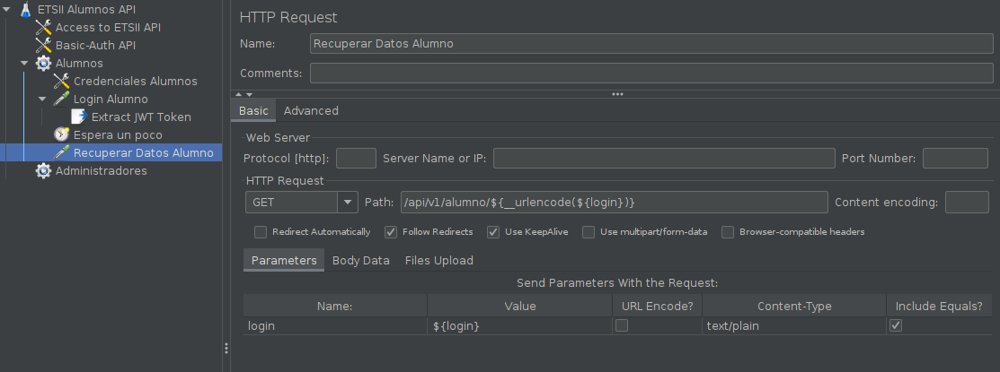

10. Usamos el gestor de cabecera HTTP

    * Un punto a tener en cuenta es que las peticiones HTTP de JMeter pasan Apache-HttpClient como User-Agent. Mejor poner una cabecera propia de un browser, por si alguien nos lo deniega.
    * Este Authorization se usa como parte de la API REST, para mantener la sesión del usuario (pues las APIs REST son _stateless_).

    > Recuperar Datos Alumno (click derecho) > Add > Config Element > HTTP Header Manager

    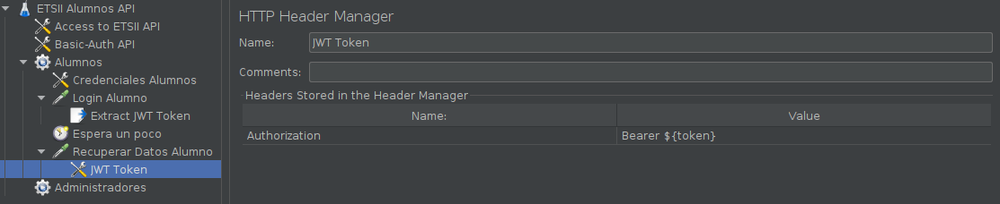

11. Repetimos los pasos anteriores (5-10) para Administradores, con las siguientes consideraciones:

    * En el paso 5, añadimos el CSV de los logins de administradores.

    * En el paso 9, como el administrador puede acceder a los datos de todos los alumnos, cambiaremos este paso por muestrear el archivo `.log` de accesos al sistema.

      > Administradores (click derecho) > Add > Sampler > Access Log Sampler

      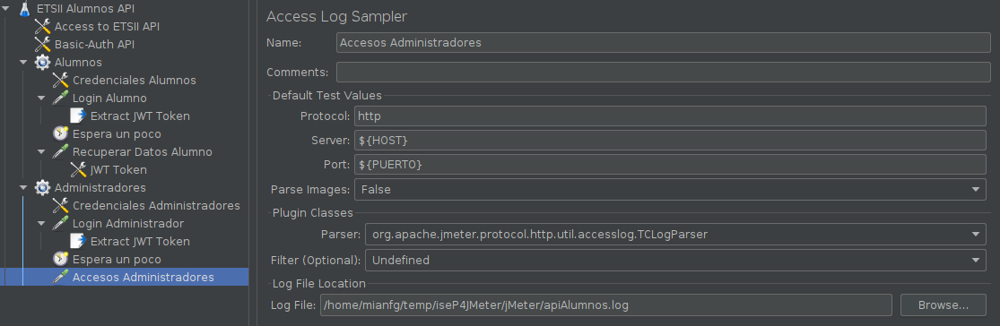

    * El paso 10, de añadir el token a la cabecera, lo haremos exactamente igual, pero desprenderá de "Accesos Administradores".

12. Añadimos los receptores de resultados.

    > ETSII Alumnos API (click derecho) > Listener > Summary Report
    >
    > ETSII Alumnos API (click derecho) > Listener > View Results in Table
    >
    > ETSII Alumnos API (click derecho) > Listener > Aggregate Report

    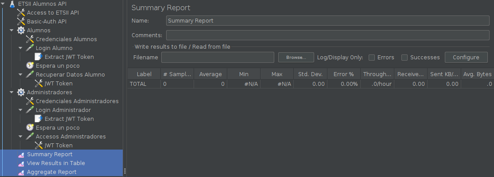

13. Añadimos el fragmento de prueba (workbench)

    > ETSII Alumnos API (click derecho) > Add > Test Fragment > Test Fragment, lo llamamos "WorkBench Test Fragment"
    >
    > WorkBench Test Fragment > Add > Listener > View Results Tree
    >
    > WorkBench Test Fragment > Add > Sampler > Debug Sampler

    

###### 5. Ejecutar el test

Iniciamos el contenedor de la aplicación

~~~
:iseP4JMeter> docker-compose-up
~~~

Arrancamos el test en la app de JMeter, con el botón de play verde. Veremos que funciona correctamente, y que nos va dando los resultados en los Listeners y Samplers. Vemos cómo el test introduce carga en el servidor

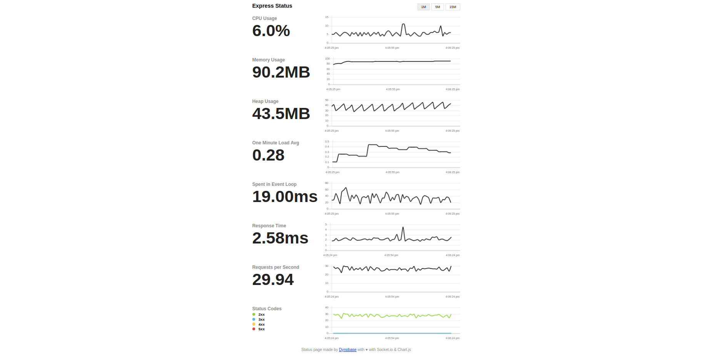

###### 6. Ejecutar el test desde terminal

* Ejecutar un test

  ~~~
  jmeter -n -t text.jmx -l output.jtl
  ~~~

  * `-n`: no GUI
  * `-t`: fichero de configuración
  * `-l`: fichero donde se guardarán los resultados

* Ver el resultado en la GUI

  1. Entramos en la GUI de JMeter
  2. Test Plan (botón derecho) > Add > Listener > Aggregate Report
  3. Desde ahí podemos introducir el archivo `jtl` para ver el output.

###### 7. Peticiones HTTPS en JMeter

Para HTTPS tenemos el problema siguiente:

* Hacemos una petición HTTPS, que pasa por el proxy
* El proxy hace la petición, toma la web, la descifra
* El proxy devuelve la página descifrada, pero la firma con su propia firma para falsear la conexión https
* El navegador esperaba una página cifrada, avisa de un posible ataque man-in-the-middle.

Para ello basta añadir el certificado de JMeter para Firefox, y no tendremos este error.

* Firefox > Preferencias > Certificados > View certificates > Import > bin > ApacheJMeterTemporaryRootCA.crt

HTTPS es HTTP sobre TLS

* TLS tiene varios estándares, el moderno es el 4.
* Para estos estándares puede ser que el truco anterior no funcione, como en el caso de la web de la UGR.
  * Si intentamos ir a ugr.es, nos da el error code: SSL_ERROR_RX_RECORD_TOO_LONG
  * Problema: firefox se tiene que identificar como Firefox, pero la petición la envía JMeter Proxy, no Firefox.
  * Modificamos la configuración de Firefox:
    * about:config > security.tls.version.max > Lo colocamos a 3
  * Ahora ya podemos entrar a la página de la UGR

### Consideraciones de cara a la entrega

* Paths relativos para que el profe pueda ejecutar los test

## Otras cuestiones

* **CineBench**: un benchmark muy chulo
  * Evalúa la capacidad de procesador para lanzar hebras en paralelo.

* Utilidad para ver JSON: `jq`
  * Uso: `... | jq`
* También hay dos interfaces similares a JMeter: Gatling y Locus, mucho más funcionales.